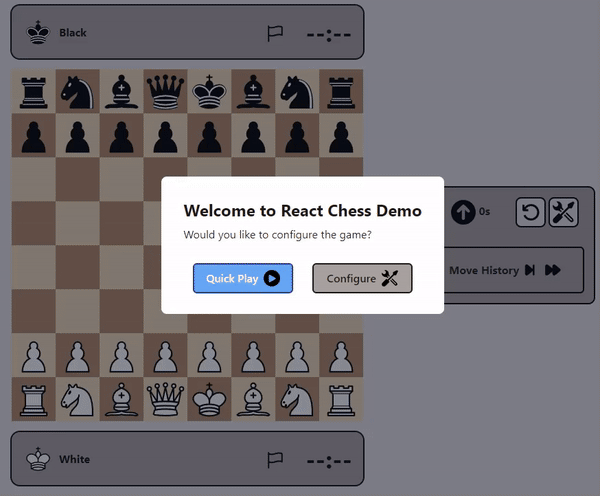

# Chess Game

A React web app for two player chess.
<p align = "center">
    </video>
</p>

# Quick Setup
- Run ``` git clone https://github.com/Luisgarchi/chess-app.git ```
- Run ``` npm install``` to install dependencies
- Run ```npm start```
*(no API key is required)*

# Features

## 1. Board
- Cursor Interaction: The cursor changes from default to pointer when hovering over squares with selectable pieces, providing clear visual cues for interaction.
- Piece Selection: Clicking on one of your pieces during your turn selects the piece, with the UI changing to indicate the selection.
- Move & Capture Indication:
    - Squares to which the selected piece can move are highlighted with a dot.
    - Potential captures are indicated by highlighting the borders of the squares containing the opponent's pieces.
    - Hovering over these squares changes the cursor to pointer, guiding the player towards possible moves or captures.
- Deselection & Turn Change: Clicking on an ineligible square or the same piece again deselects the piece and removes all overlays, reverting the UI to its default state.

## 2. Game History
- Each move made during the game is recorded and displayed in the sidebar's game history section.
- The game history lists full moves as rows, with the move made by the white player in the left column and the black player's move in the right column.
- Upon making a move, the UI updates to highlight the most recent move. This includes an autofocus feature to ensure the latest action is always visible and not obscured by the sidebar's scroll functionality.

### Navigating Through the Move History

- Clicking on a move within the game history section allows players to view the board's configuration at that specific moment. While reviewing the game's history, the board will be inactive, preventing any new moves from being made until the board is returned to the current game position.
- Players can navigate through the game history using arrow toggles:
    - The double forward arrow takes the player to the board state reflecting the current position of the game.
    - The double backward arrow transports the player to the initial board state before any moves were executed.
    - The single forward arrow advances the board state by one move from the currently active board state.
    - The single backward arrow moves the board state back by one move from the currently active state, facilitating a detailed analysis of the game's progression.


## 3. Game and App State Flow

The application and the gameplay can be intuitively managed through dialog modals, which are activated in specific scenarios to enhance the user experience and game interaction. These modals serve as crucial interfaces for player interaction, game configuration, and notifications of game status changes.

- Welcome Message: The modal displays a WelcomeMessage component, greeting players and introducing them to the game.
- Game Configuration: allows players to customize their game settings before beginning.
- Game Over Notification: Upon the game reaching a "game-over" state it notifies players of the game's conclusion and the outcome.